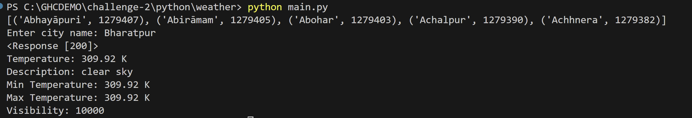

# Code Conversion Using GHC

## Prerequisites

Before you begin, ensure you have the following:

1. Python installed on your system. ( [Download Python | Python.org](https://www.python.org/downloads/))
2. A free account on [OpenWeatherMap](https://home.openweathermap.org/) After signing up, obtain your API key.

## Challenge Details

This challenge involves converting TypeScript code to Python using Github Copilot. Here's what you need to do:

1. We have provided TypeScript code that includes APIs for fetching weather information for a given city and a method for retrieving a list of cities from a sample JSON file. Refer to the **./GHCDEMO/code-conversion/typescript** directory.
2. We have also provided Python base files. Refer to the **./GHCDEMO/code-conversion/python/ directory**.
3. Your goal is to convert the TypeScript APIs to Python using Github Copilot. Convert these APIs in Python and add the implementation of these APIs in **./GHCDEMO/code-conversion/python/weather/utils.py** After that, call these APIs from **./GHCDEMO/code-conversion/python/weather/utils.py**
4. Add your API key to **./GHCDEMO/code-conversion/python/weather/config.py** is required for making a fetch request for getting weather infromation.
5. Run the Python code by navigating to the **./GHCDEMO/code-conversion/python/weather/utils.py** directory and executing the command `python main.py`.
6. You will be prompted to enter a city name. Enter ant city name which is available in `sampleCityList.json`. After that, you should be able see the response printed in the terminal.

After completing share screenshot of your terminal. It should look like below image.

Good luck with your challenge!
